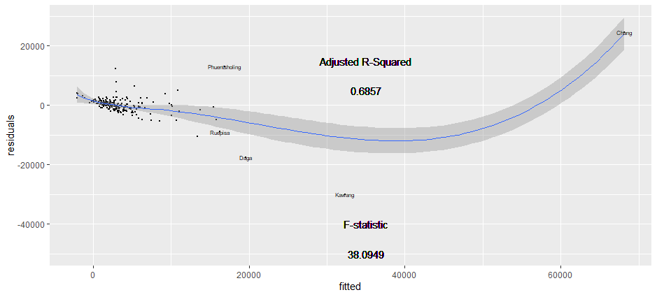

# Final Project Deliverable: Bhutan

## Political Subdivisions

The Kingdom of Bhutan is a country located in the Eastern Himalayas in Southern Asia. Bhutan consists of 2 levels of administrative subdivisions, with the larger regions being the 20 dzongkhags/districts in gold labels and the smaller regions being the 205 gewogs/collection of villages in the black labels. Out of the 20 dzongkhags/districts, the main area
I have been analyzing is Thimphu, the most populous region and capital city of the country. 

## Population 

Bhutan has a total population of roughly 754,394 people. As shown in the image above, which describes the population in each dzongkhag/district, it can be seen that the region of Thimphu is considerably more populated than any other region. Being the capital region, a large percentage of the country's population is concentrated in that district, with about 98,676 people in that area, which makes up a seventh of the country's total population. In terms of density, Thimphu also has the highest persons to kilometers squared ratio out of any of the other districts.

Above is a model describing the relationships between the population (x-axis) and the sum of 12 different covariates functionining as predictors of population. The covariates used include, but are not limited to, night-time lights, urban cover, and bare cover. Starting in the middle of the model, population appears to increase as the values of the covariates increase. This was done at the second administrative level, with the labelled points being the gewogs. The position of the points in relation to the line indicate the accuracy of the prediction, with points closer to the line being more accuratley predicted in terms of population.
