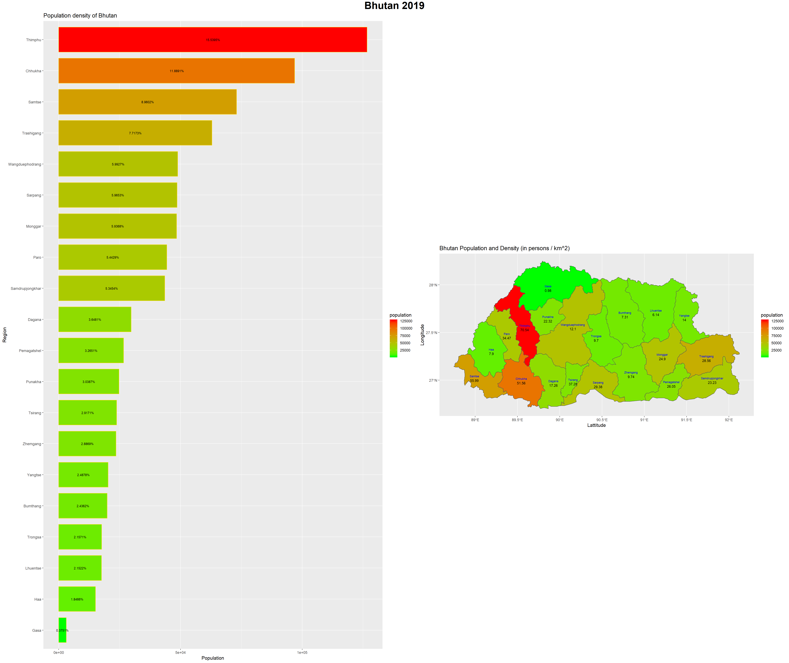

# Final Project Deliverable: Bhutan

## Political Subdivisions

The Kingdom of Bhutan is a country located in the Eastern Himalayas in Southern Asia. Bhutan consists of 2 levels of administrative subdivisions, with the larger regions being the 20 dzongkhags/districts in gold labels and the smaller regions being the 205 gewogs/collection of villages in the black labels. Out of the 20 dzongkhags/districts, the main area
I have been analyzing is Thimphu, the most populous region and capital city of the country. 

## Population 

Bhutan has a total population of roughly 754,394 people. As shown in the image above, which describes the population in each dzongkhag/district, it can be seen that the region of Thimphu is considerably more populated than any other region. 
