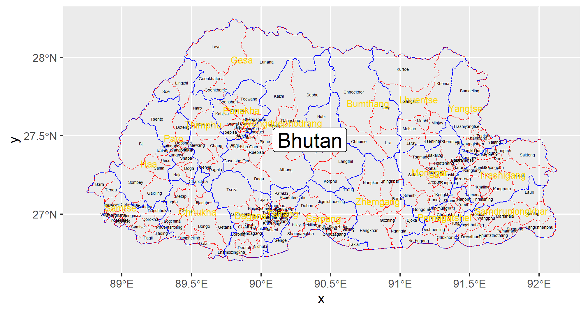

# Final Project Deliverable: Bhutan

## Political Subdivisions

Bhutan is classified in 2 levels of administrative subdivisions, with the larger regions being the dzongkhags/districts in gold and the smaller regions being the gewogs/collection of villages. 
