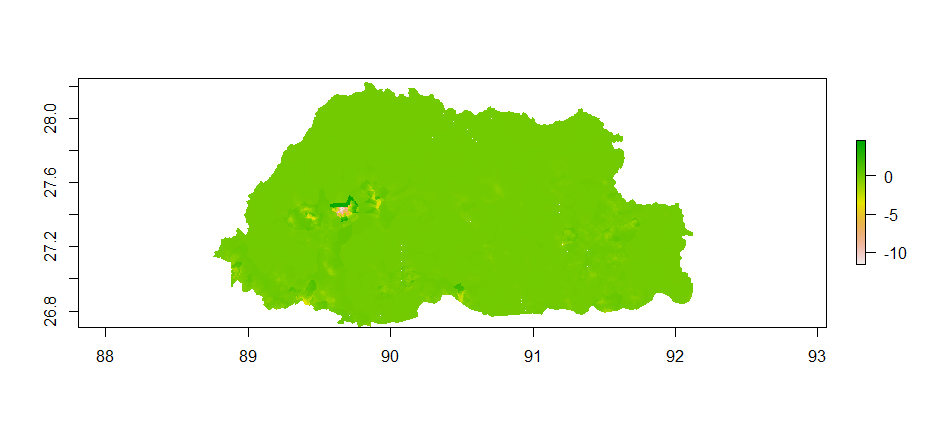
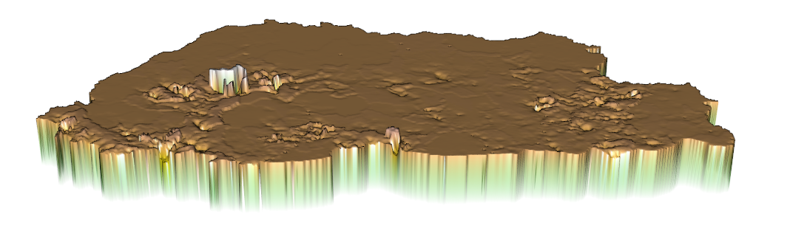

# Final Project Deliverable: Bhutan

## Political Subdivisions

The Kingdom of Bhutan is a country located in the Eastern Himalayas in Southern Asia. Bhutan consists of 2 levels of administrative subdivisions, with the larger regions being the 20 dzongkhags/districts in gold labels and the smaller regions being the 205 gewogs/collection of villages in the black labels. Out of the 20 dzongkhags/districts, the main area
I have been analyzing is Thimphu, the most populous region and capital city of the country. 

## Population 

Bhutan has a total population of roughly 754,394 people. As shown in the image above, which describes the population in each dzongkhag/district, it can be seen that the region of Thimphu is considerably more populated than any other region. Being the capital region, a large percentage of the country's population is concentrated in that district, with about 98,676 people in that area, which makes up a seventh of the country's total population. In terms of density, Thimphu also has the highest persons to kilometers squared ratio out of any of the other districts.

Above is a model describing the relationships between the population (x-axis) and the sum of 12 different covariates functioning as predictors of population. The covariates used include, but are not limited to, night-time lights, urban cover, and bare cover. Starting in the middle of the model, the population appears to increase as the values of the covariates increase. This was done at the second administrative level, with the labeled points being the gewogs. The position of the points with the line indicates the accuracy of the prediction, with points closer to the line being more accurately predicted in terms of population. 

After testing the population and log of population response variables against the sums and means of the covariate predictors, it was concluded that the model using population as the response variable and covariate sums as the predictors showed the best results. As seen above in the plots that show the same results, one in 2D and one in 3D, there is a small degree of error in the country overall, with the most error being found in the urban/populous region of Thimphu. 

## Human Settlements, Roadways and Health Care Facilities

The above plot describes the relative locations of infrastructure such as roads, health care facilities, and main urban areas in the district of Thimphu. The primary highways/roadways are colored in red while the secondary feeder roads/roadways are colored in blue. The white dots on this map represent hospitals in the region, orange dots representing clinics, and black dots representing all other types
of health care facilities. The red dot represents a dense concentration of people. Spatially, a majority of the health care facilities and a portion of the primary and secondary roads are located directly in the main urban area depicted by the light blue shading. This area is the location of the capital city and the most densely populated area, marking a direct relationship between facilities and population. 

The image above shows the topography of Thimphu and the relative locations of roads, health care facilities, and urban areas. Due to Bhutan being a generally mountainous region overall, it can be seen that most infrastructure is present in areas of lower elevation, along with areas of dense population. In terms of development, Bhutan is generally an underdeveloped country. The large range of mountains makes it hard to construct infrastructure. The country also highly values its traditions and culture, which may or may not impact the development of the country as a whole. 
