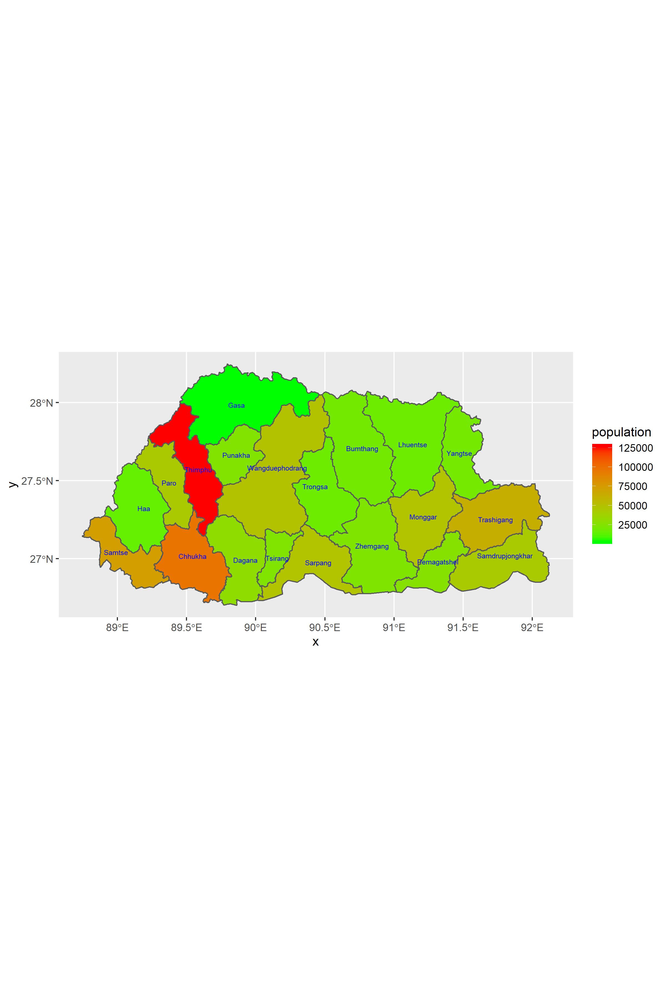

# Project 1 Deliverable: Bhutan 

[Part 1: Projecting, Plotting and Labelling Administrative Subdivisions]

Part 1: The first image consists of Bhutan divided into its 20 districts (adm1) and 205 gewogs (group of villages) (adm2).
        The districts varied greatly in terms of the sub-divisions within them, as some districts such as the Gasa districts would only 
        have 4 large sub-divisions within it. In contrast, other districts like the Trashigang district contain 13 gewogs. 
        This was a rather minor complication in that finding a text size that wasn't too small for the large districts but also not too
        big to fit within the smaller gewogs.
        
[Part 2: Extracting Populations from a Raster and Aggregating to each Unit]

Part 2: This image consists of Bhutan with its population densities in each district modelled on. The color gradient represents the 
        population densities, with red districts being more dense than green districts. It is seen that most districts have a
        rather low to medium density when compared to Thimphu, the country's capital, which has the highest population density. 
        
        
[Part 3: Creating a Geometric Bar Plot with your Simple Feature object]

        
Part 3: This image was produced by combining both a bar plot and a spatial map plot of Bhutan. The bar plot ranks the population
        densities for the districts from highest to lowest. The spatial plot is similar to the one in part 2 except for the 
        fact that the population density in persons / km ^2 are now included on each district. In terms of modifications, only slight
        adjustments to the density measurements on the spatial plot needed to be made in order to make sure the numbers did not overlap
        with the district names. As it has been before, the nation's population seem to be evenly scattered throughout the country except
        for in its capital, Thimphu, which concentrates a large density of the population into that one area.

