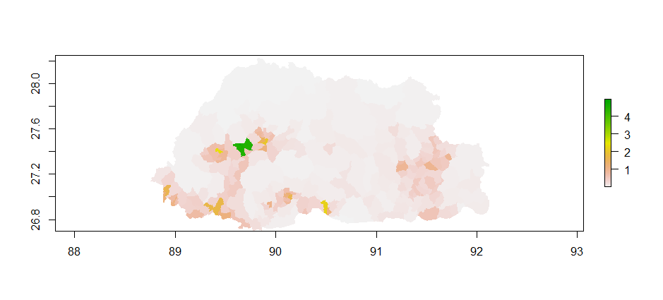
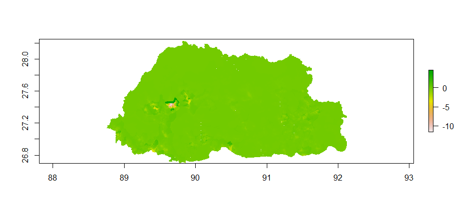
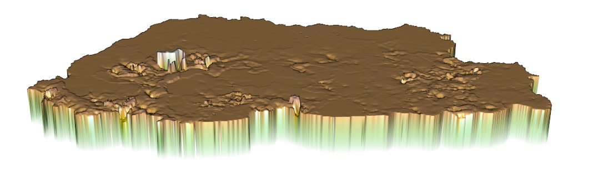
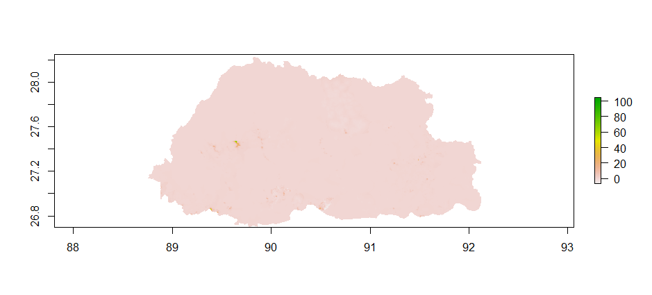
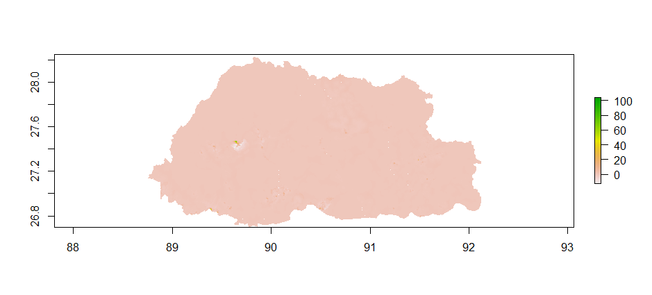
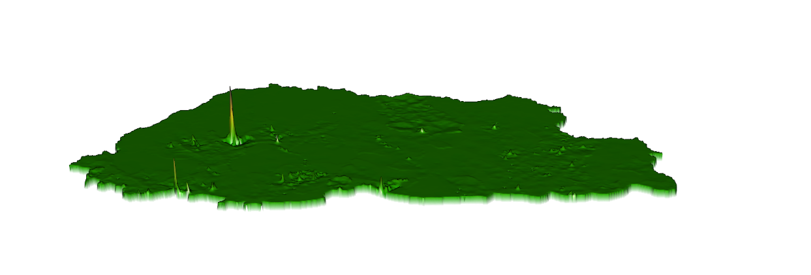
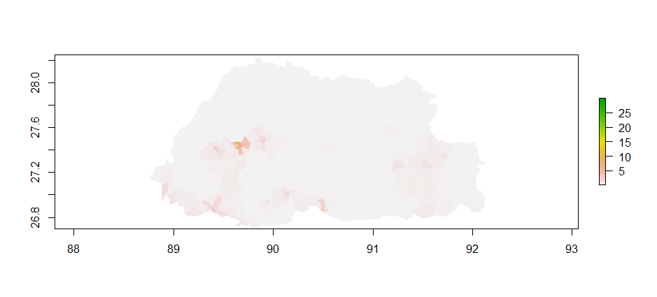
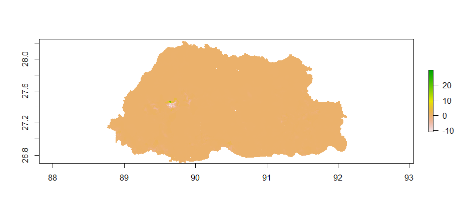
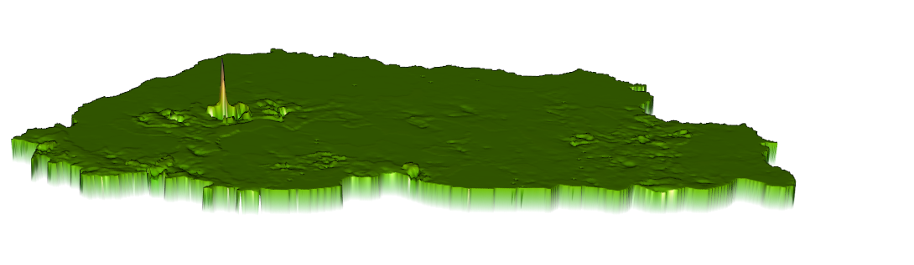

# Part 2 Project Deliverable: Bhutan

## Response variable is population and the predictors are sum of covariates

### Predicted Population

### Differences between predicted plot and World Pop Estimates

### 3D Plot

## Response variable is population and the predictors are means of covariates

### Predicted Population

### Differences between predicted plot and World Pop Estimates

### 3D Plot

## Response variable is log of population and the predictors are mean of covariates

### Predicted Population

### Differences between predicted plot and World Pop Estimates

### 3D Plot

## Conclusion

Out of the three models, I believe that the model using population as the response variable and covariate sums as the predictors showed the best results. It was a common trend within all the models that the most error would be found in the capital city of Thimphu. When comparing the predicted and the actual values of the models, I found that both the models using the means of covariates as the predictors tended to overestimate in their error. Looking at the 3D plots in both of those, the plot with log of population as the response variable had error that was just a bit lower in magnitude when compared with the other means model. In the end however, both magnitudes of error were considerably high. The range of error was wide in both of the means models as well. The model using population as the response variable had an error range from 0-100, while the model using the log of population as the response variable ranged from around -10 to 25. Putting all of this into consideration, I chose the model using population as the response variable and covariate sums as the predictors as the best models because of the small range of error it had when compared to the other models, ranging from around -10 to 5. It is clearly visible on its 3D plot as well, with the peaks being much shorter and flat compared to the others.
