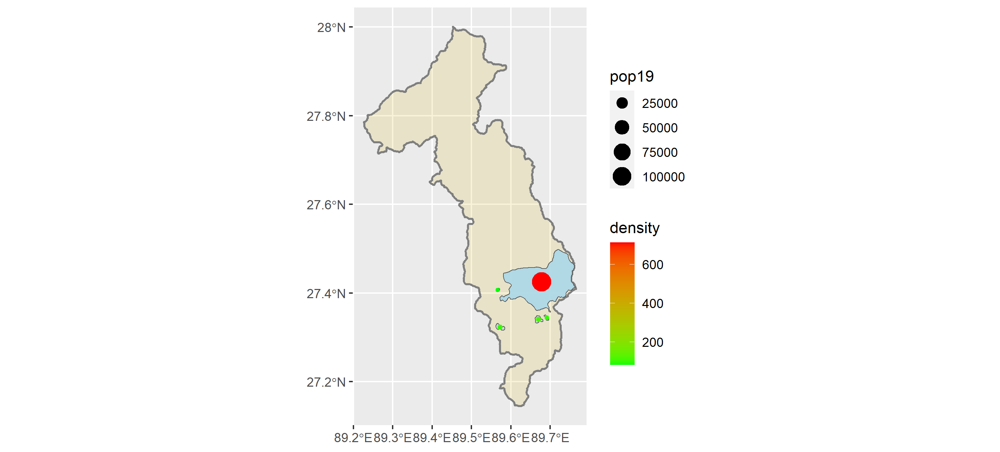
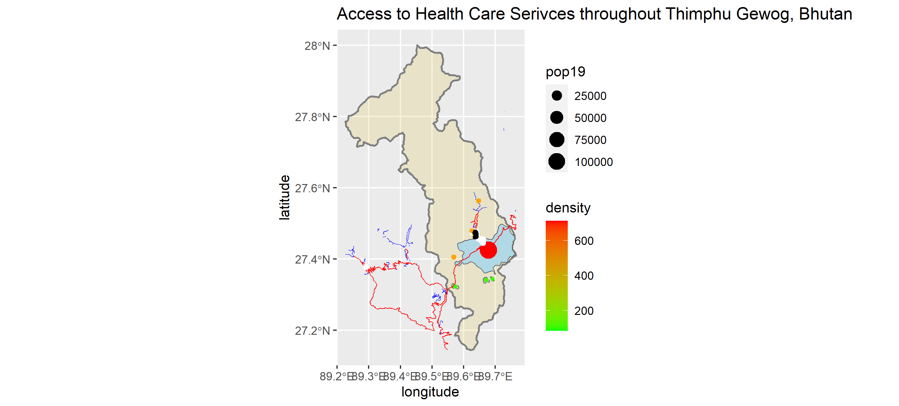

# Project 3 Deliverable: Bhutan
# Part 1: De facto description of human settlements and urban areas

This is the adm1 region of Thimphu in Bhutan. The entire region consists of a human population of around 115,000 persons. The capital city
of Thimphu is the most densely populated area in the entire country, containing 80,000 persons. The most notable urban area containing the large red dot represents the capital area.
Outside of the capital area, however, doesn't appear to be many other human settlements or urban areas except for a few that are
represented by the green dots. This shows just how condensed the population is into its capital city. 

# Part 2: Adding transportation facilities & health care services

In this picture, the primary highways/roadways are colored in red while the secondary feeder roads/roadways are colored in blue. It can be
seen that one highway is the main road in almost the entire urban area of the capital city. However, it can be seen that more roads appear
to continue outside of the Thimphu region into another, which may indicate another possible urban area outside of this region. The white
dots on this map represent hospitals in the region, orange dots representing clinics, and black dots representing all other types
of health care facilities. Most of the health care facilities are concentrated in the Northern part of the region. Which is close to where
the main concentration of people are in the region represented by the red dot. 
