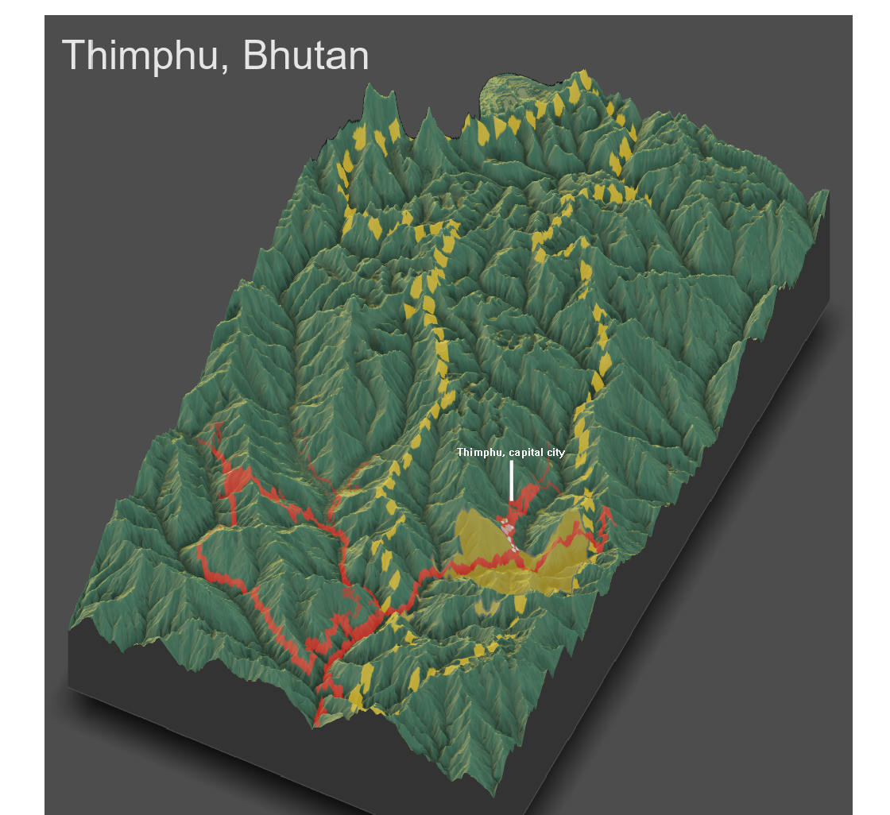

# Project 4 Deliverable: Bhutan 

## [Part 1: Rendering Topography]

Above is the topographic image of Thimphu, Bhutan. As seen in the image, the region is extremely mountainous, which appears to affect the locations of infrastructure and urban areas. Topography appears to affect where the urban area(s) are located, as the primary urban area in the region is located in an area of lower elevation compared to the rest of the region. The roads and transportation facilities follow a similar pattern, in that they are located between mountainous areas where the elevation is low. Health care facilities are generally located close to the main urban area, indicating the same effect topography had on where the urban area was. The topography of Thimphu supported my interpretation of my previous analysis, as it is much harder in general for populations to build and maintain themselves and infrastructure in areas of higher elevation.
